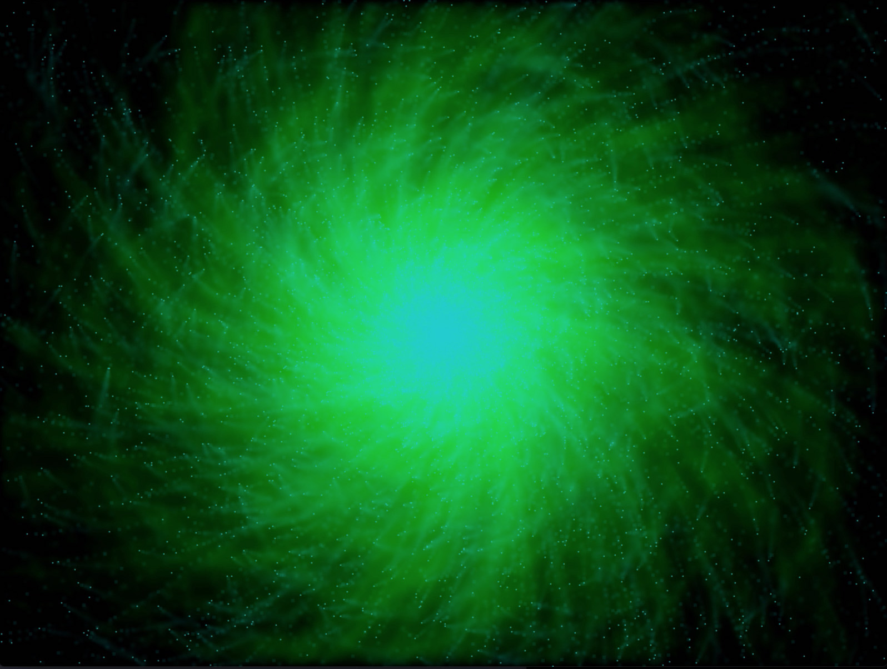

# Particle Explosion Simulation

An altered version of original [Particle Fire Simulation application by John Purcell](https://www.youtube.com/watch?v=RWxv2Sniqqo&list=PLmpc3xvYSk4wDCP5zjt2QQXe8-JGHa4Kt&index=56)

## Project Description

Description in progress...

## Structure & Logic

In progress...

### Expected Behavior

In progress...

## Dependencies for Running Locally

* cmake >= 2.6
  * All OSes: [click here for installation instructions](https://cmake.org/install/)
* make >= 4.1 (Linux, Mac), 3.81 (Windows)
  * Mac: [install Xcode command line tools to get make](https://developer.apple.com/xcode/features/)
  * Linux: make is installed by default on most Linux distros
  * Windows: [Click here for installation instructions](http://gnuwin32.sourceforge.net/packages/make.htm)
* gcc/g++ >= 5.4
  * Mac: same deal as make - [install Xcode command line tools](https://developer.apple.com/xcode/features/)
    * An alternative to conventional gcc/g++ on Mac: use llvm-gcc (`export CC=/usr/bin/llvm-gcc`) and llvm-g++ (`export CXX=/usr/bin/llvm-g++`)
  * Linux: gcc / g++ is installed by default on most Linux distros
  * Windows: recommend using [MinGW](http://www.mingw.org/)
* SDL2 >= 2.0.0 ([general installation instructions](https://www.libsdl.org/download-2.0.php)) for Mac, Linux and Windows

## Build Instructions

After installing project dependencies, please proceed to build:

1. Clone this repository into your project folder
1. Make a build directory in the top level directory: `mkdir build && cd build`
1. Compile -> Step 1: `cmake ..`
1. Compile -> Step 2: `make`
1. Run the application: `./particles`
